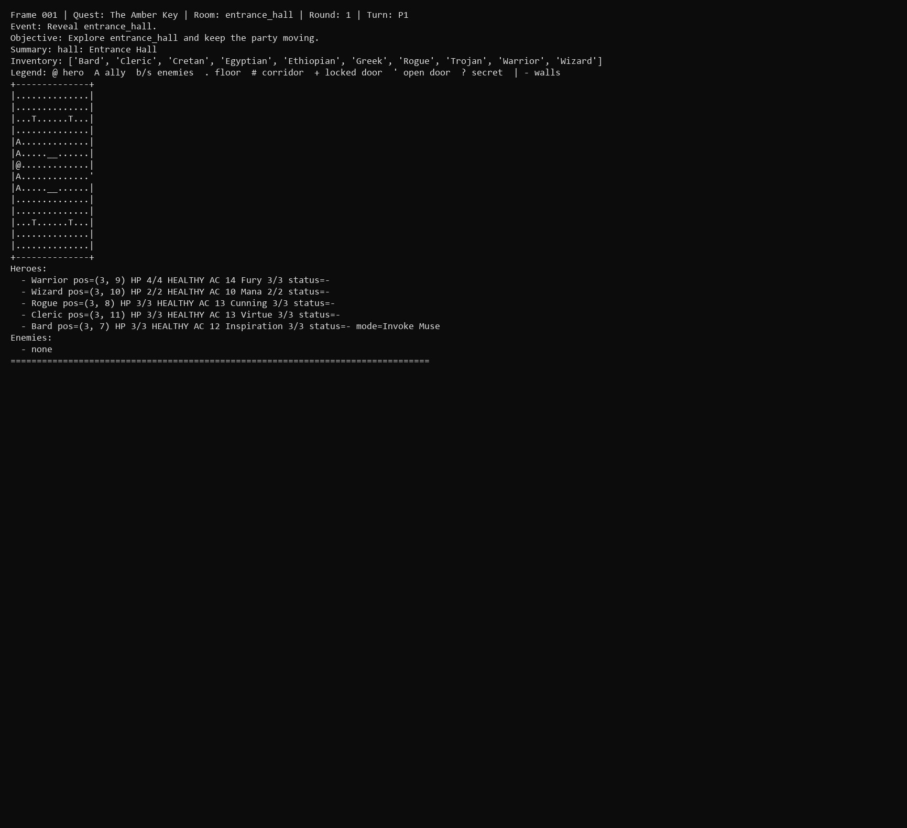

## Dungeon Skirmish: Rules-First Tactical RPG

Room-by-room dungeon crawler built around a rules-first combat contract rather than ad hoc encounter scripts. The project combines party-based tactical combat, a continuous ASCII dungeon map, deterministic regression harnesses, and artifact capture for replayable debugging.

### Core Systems

- **Rules-first skirmish engine**: Five-hero party (`Warrior`, `Wizard`, `Rogue`, `Cleric`, `Bard`) with distinct resources, wound tracks, tactics, spell effects, and Oracle-driven enemy behavior.
- **Quest + dungeon shell**: `The Amber Key` scripts room contents, locks the boss door behind an amber key, and projects room-local combat onto a global dungeon map with corridors and reveal state.
- **Playable terminal controller**: One-key command layout for move, attack, spell, search, item, tactic, and door actions, with NetHack-style status panes and live intent feedback.

### Engineering Depth

- **Deterministic artifact harness**: `playthrough_capture.py` records PNG/TXT frame captures, trace JSON, and animated GIF exports from seeded runs so gameplay regressions are inspectable instead of anecdotal.
- **Persistent checkpoints**: Dungeon reveal state writes to SQLite, letting the same quest shell persist room progression and replay state cleanly across sessions.
- **Behavioral coverage**: Unit tests cover roster contract, wound progression, room reveal, door opening, combat spawning, search/listen flows, tactics, rendering, and full sample-playthrough completion through the boss room.

### Why It Matters

This is game programming as systems engineering: combat rules, UI, persistence, replay tooling, and testability were all built together. It shows comfort with interactive state machines, deterministic simulation, and turning a toy game into a debuggable software artifact.
